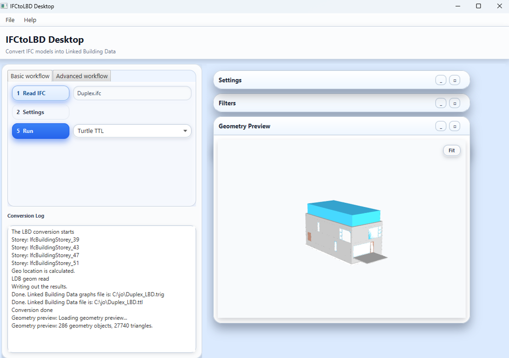

# IFCtoLBD

Version 2.52.0 · Free for all of us, forever.

IFCtoLBD turns an IFC building model into **Linked Building Data (LBD)**: RDF
triples that describe buildings, spaces, elements, and their properties. You can
query these triples and connect them to other data, such as asset records,
products, or sensors. The current source supports IFC STEP, IFC/XML, and IFC/JSON.

## What can you do with IFCtoLBD?

- **Convert an IFC model into linked data** with the desktop app and save it as
  Turtle or JSON-LD.
- **Choose what to export:** select element types, property sets, and options
  for properties, units, and geometry.
- **Explore your building:** query the data with SPARQL, validate it with SHACL,
  and preview exported geometry in the desktop app.
- **Connect building information** to asset records, products, sensors, and
  other datasets using the generated resource identifiers.
- **Automate your work** with the command-line converter, Python examples, or
  the Java library.
- **Build your own tools and extensions** from the source: add mappings,
  vocabularies, validation rules, geometry backends, or domain-specific enrichment.

The guides below show you where to start. Available features depend on the
release and export settings you choose.

## New to IFC? Start with the standard

**Industry Foundation Classes (IFC)** is an open, vendor-neutral standard from
buildingSMART for exchanging building and infrastructure information. An IFC
model can describe geometry, elements, spaces, properties, and relationships.
Read [buildingSMART’s introduction to IFC](https://www.buildingsmart.org/standards/bsi-standards/industry-foundation-classes/)
if you need the background. For technical definitions, follow its links to the
IFC specifications. You can skip this introduction if you already use IFC.

## Start here: convert your IFC without programming

You need an IFC model and the desktop application.

1. Open [Releases](https://github.com/jyrkioraskari/IFCtoLBD/releases), expand
   **Assets**, and download the **desktop JAR distribution** for your platform.
   On Windows, macOS, or Linux,
   [check or install Java 21](docs/quick-start.md#install-java-21-for-the-jar-route),
   then launch the desktop JAR. Keep the complete distribution together and
   check the chosen release’s requirements.
2. Start the desktop application. Click **Read IFC**, choose your model, and
   wait for it to finish reading. The application proposes an output path.
3. Check that output path, then click **Run**. For your first conversion, keep
   the existing settings and filters. Wait for the conversion log to report completion.
4. Open the generated `.ttl` file in a text editor. It contains RDF in Turtle
   format. You have converted your first IFC model to Linked Building Data.

**Windows command-line alternative:** the Windows `.exe` is a command-line
converter, not a desktop application. Use it from PowerShell or Command Prompt;
[see the Windows CLI instructions](docs/quick-start.md#windows-alternative-use-the-command-line-exe).

[Follow the desktop quick start](docs/quick-start.md) for launch commands,
output choices, and help if the application does not start. Features and button
layout can differ between released versions and this source checkout.



## What would you like to do next?

| Your goal | Guide |
| --- | --- |
| Understand LBD and use the generated triples | [LBD, RDF, and your first queries](docs/using-triples.md) |
| Read the output or automate conversion in Python | [Python guide](docs/python_examples.md) |
| Embed the converter and query its output in Java | [Java guide](docs/java_examples.md) |
| Compile the converter, understand the subprojects, or extend it | [Build and development guide](docs/development.md) |
| Explore classification, product identity, GS1, or EPD output | [Supply-chain and sustainability](docs/supply-chain-and-sustainability.md) |

Start with the output you have just created; programming and compiling can come
later. LBD uses shared vocabularies such as the
[Building Topology Ontology (BOT)](https://w3c-lbd-cg.github.io/bot/).
The [W3C Linked Building Data Community Group](https://www.w3.org/community/lbd/)
provides further background and community resources.

Browse the [documentation website](https://jyrkioraskari.github.io/IFCtoLBD/#/)
or the [documentation index](docs/README.md). Earlier announcements are in
[project history](docs/history.md).

## Contributors

Jyrki Oraskari, Mathias Bonduel, Kris McGlinn, Anna Wagner, Pieter Pauwels, Ville Kukkonen, Simon Steyskaland, Joel Lehtonen, Maxime Lefrançois, and Lewis John McGibbney. Thanks also to Vladimir Alexiev, Kathrin Dentler and Lukas Kirner for their valuable insights.


## License

This project is released under the open source [Apache License, Version 2.0](http://www.apache.org/licenses/LICENSE-2.0)

## How to cite

```
@misc{jyrki\_oraskari\_2026\_07,
 author       = {Jyrki Oraskari and
                  Mathias Bonduel and
                  Kris McGlinn and
                  Pieter Pauwels and
                  Freddy Priyatna and
                  Anna Wagner and
                  Ville Kukkonen and
                  Simon Steyskaland and
                  Joel Lehtonen and
                  Maxime Lefrançois },
  title        = {{IFCtoLBD v 2.52.0}},
  month        = 07,
  year         = 2026,
  publisher    = {GitHub},
  version      = {2.52.0},
  url          = {https://github.com/jyrkioraskari/IFCtoLBD}
}

```


## Acknowledgements

The research was partly funded by the EU through the H2020 project
[BIM4REN](https://dc.rwth-aachen.de/de/forschung/bim4ren).
