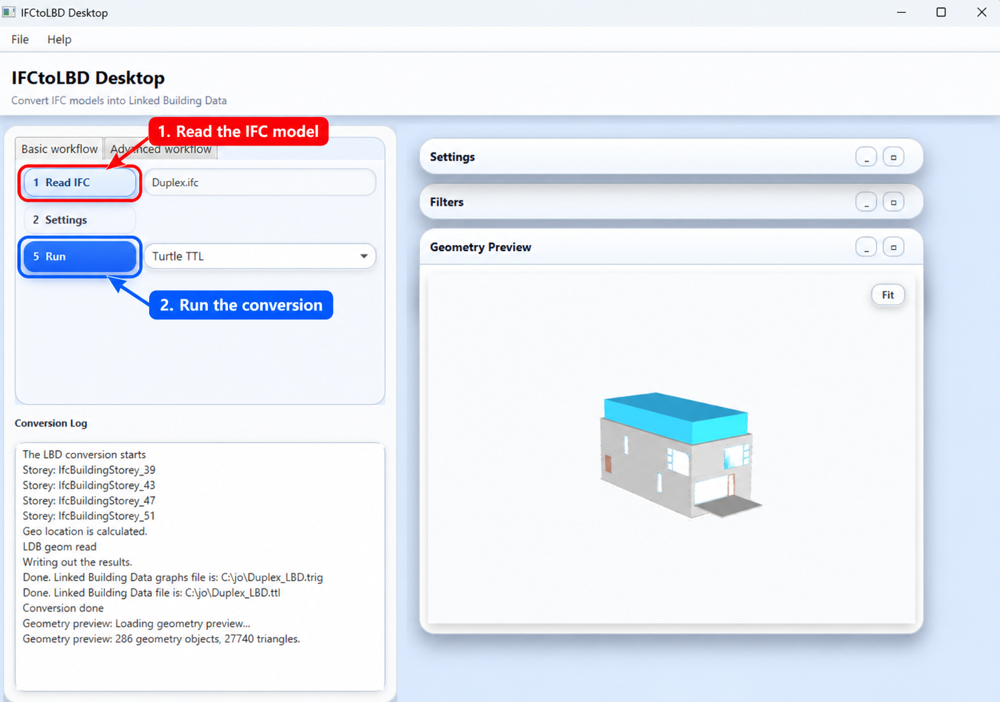

# IFCtoLBD

Development version 2.54.1 · Stable release used by the beginner guide: [2.49.0](https://github.com/jyrkioraskari/IFCtoLBD/releases/tag/2.49.0) · Free for all of us, forever.

IFCtoLBD turns an IFC building model into **Linked Building Data (LBD)**: small
subject–relationship–value facts, called RDF triples, that describe buildings,
spaces, elements, and their properties. You can query these facts and use LBD in
your own applications to link building
information to other data. Development version 2.54.1 supports IFC STEP,
IFC/XML, and IFC/JSON.

**Audience and prerequisites.** The desktop quick start is for BIM practitioners,
data engineers, and researchers and requires no programming. Bring an IFC file;
the Java distribution also requires Java 21. **New to IFC?** Read the short
introduction below. **New to RDF or SPARQL?** Start with the
[conceptual overview](docs/overview.md), then follow
[using the triples](docs/using-triples.md). Developers need Java 21 and Maven.

> **Try IFCtoLBD in ten minutes.** The
> [checked example bundle](examples/getting-started/README.md) includes small IFC
> models, saved configurations, SPARQL questions, and expected answers for a
> building inventory, a completeness check, and a revision comparison. The
> bundle targets development version 2.54.1.

## What can you do with IFCtoLBD?

- **Convert an IFC model into linked data** with the desktop app and save it as
  Turtle, JSON-LD, or an ICDD package containing the original IFC and separate
  Linked Building Data submodels.
- **Choose what to export:** select element types, property sets, and options
  for properties, units, and geometry.
- **Explore your building:** query the data with SPARQL, validate it with SHACL,
  and preview exported geometry in the desktop app.
- **Prepare building data for linking:** the generated LBD identifiers let you
  create links to asset records, products, sensors, and other datasets in your
  own applications. The converter does not create those external links for you.
- **Automate your work** with the command-line converter, Python examples, or
  the Java library.
- **Build your own tools and extensions** from the source: add mappings,
  vocabularies, validation rules, geometry backends, or domain-specific enrichment.

The guides below show you where to start. The beginner workflow is pinned to
release 2.49.0; source-only 2.54.1 features are identified separately.

## The pieces of IFCtoLBD

| Piece | Use it when | Artifact or entry point |
| --- | --- | --- |
| Desktop app | You want the **Read IFC → Run** interface | `IFCtoLBD.zip` or `IFCtoLBD-Desktop_for_Windows.zip` in release 2.49.0 |
| CLI | You want scripted conversion on Windows | `IFCtoLBDConverter_CLI.exe` in release 2.49.0 |
| Java library | You are embedding conversion in a JVM application | `org.linkedbuildingdata:ifc-to-lbd:<version>` / `ifc-to-lbd-<version>.jar` |
| MCP server | You want an AI tool to inspect or convert IFC | `IFCtoLBD_MCP`; build from source because release 2.49.0 has no prebuilt MCP server |

These are the exact names for release 2.49.0. New releases follow the
[artifact naming policy](docs/development.md#artifact-names).

## New to IFC? Start with the standard

**Industry Foundation Classes (IFC)** is an open, vendor-neutral standard from
buildingSMART for exchanging building and infrastructure information. An IFC
model can describe geometry, elements, spaces, properties, and relationships.
Read [buildingSMART’s introduction to IFC](https://www.buildingsmart.org/standards/bsi-standards/industry-foundation-classes/)
if you need the background. For technical definitions, follow its links to the
IFC specifications. You can skip this introduction if you already use IFC.

## Start here: convert your IFC without programming

You need an IFC model and the desktop application.

1. Open the [2.49.0 release](https://github.com/jyrkioraskari/IFCtoLBD/releases/tag/2.49.0), expand
   **Assets**, and choose `IFCtoLBD.zip` for the Java 21 distribution or
   `IFCtoLBD-Desktop_for_Windows.zip` for the bundled Windows application. The
   bundled Windows application includes Java. The Java distribution needs
   [Java 21](docs/quick-start.md#install-java-21-for-the-jar-route).

   

2. Start the desktop application. For a result you can check, use the small
   [two-wall example model](examples/getting-started/building-inventory/model.ifc).
   Click **Read IFC**, choose the model, and
   wait for it to finish reading. The application proposes an output path.
3. Check that output path, then click **Run**. For your first conversion, keep
   the existing settings and filters. Wait for the conversion log to report completion.
4. In development version 2.54.1, open **Query**, paste the saved
   [building inventory query](examples/getting-started/building-inventory/query.rq),
   and click **Run query**. The useful result is immediate: the storey contains
   two walls. Compare it with the
   [expected result](examples/getting-started/building-inventory/expected.txt).


[Follow the release-pinned desktop quick start](docs/quick-start.md) for launch
commands, output choices, and help if the application does not start.

**Windows command-line alternative:** `IFCtoLBDConverter_CLI.exe` is the Windows
command-line converter. Use it from PowerShell or Command Prompt;
[see the Windows CLI instructions](docs/quick-start.md#windows-alternative-ifctolbdconverter_cliexe).
The same functionality is available as a Java app for Linux and macOS users.


## What would you like to do next?

| Your goal | Guide |
| --- | --- |
| Understand LBD and use the generated triples | [Conceptual overview](docs/overview.md), then [your first queries](docs/using-triples.md) |
| Read the output or automate conversion in Python | [Python guide](docs/python_examples.md) |
| Embed the converter and query its output in Java | [Java guide](docs/java_examples.md) |
| Use AI to inspect, query, validate, and convert IFC models | [MCP tutorial](docs/mcp.md) — build from source; release 2.49.0 has no prebuilt MCP package |
| Compile the converter, understand the subprojects, or extend it | [Build and development guide](docs/development.md) |
| Explore classification, product identity, GS1, or EPD output | [Supply-chain and sustainability](docs/supply-chain-and-sustainability.md) |

Start with the output you have just created; programming and compiling can come
later. LBD uses shared vocabularies such as the
[Building Topology Ontology (BOT)](https://w3c-lbd-cg.github.io/bot/).
The [W3C Linked Building Data Community Group](https://www.w3.org/community/lbd/)
provides further background and community resources.

Browse the [documentation website](https://jyrkioraskari.github.io/IFCtoLBD/#/)
or the [documentation index](docs/README.md). Earlier announcements are in [project history](docs/history.md).

## Contributors and citation authors

The citation authors, in the same order as `CITATION.cff`, are Jyrki Oraskari,
Mathias Bonduel, Kris McGlinn, Pieter Pauwels, Freddy Priyatna, Anna Wagner,
Ville Kukkonen, Simon Steyskaland, Joel Lehtonen, and Maxime Lefrançois.
Additional contributions were made by Lewis John McGibbney. Thanks also to
Vladimir Alexiev, Kathrin Dentler, and Lukas Kirner for their valuable insights.


## License

This project is released under the open source [Apache License, Version 2.0](http://www.apache.org/licenses/LICENSE-2.0)

## How to cite

```
@misc{jyrki\_oraskari\_2026\_07,
 author       = {Jyrki Oraskari and
                  Mathias Bonduel and
                  Kris McGlinn and
                  Pieter Pauwels and
                  Freddy Priyatna and
                  Anna Wagner and
                  Ville Kukkonen and
                  Simon Steyskaland and
                  Joel Lehtonen and
                  Maxime Lefrançois},
  title        = {{IFCtoLBD v 2.54.1}},
  month        = 07,
  year         = 2026,
  publisher    = {GitHub},
  version      = {2.54.1},
  url          = {https://github.com/jyrkioraskari/IFCtoLBD}
}

```


## Acknowledgements

The research was partly funded by the EU through the H2020 project
[BIM4REN](https://dc.rwth-aachen.de/de/forschung/bim4ren).
