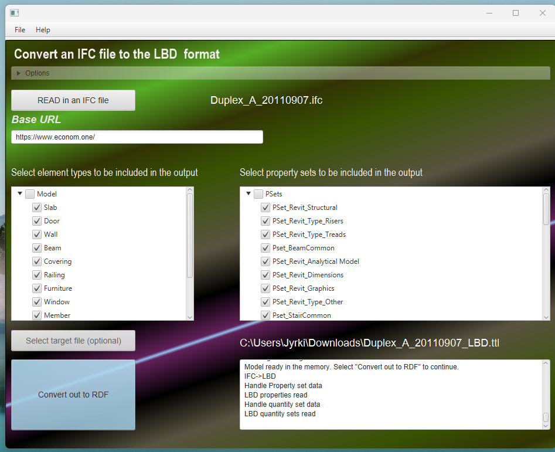

# IFCtoLBD
Version 2.45.0
Free for all of us, forever.

The IFCtoLBD converter transforms Industry Foundation Classes (IFC) files in STEP format into Resource Description Framework (RDF) triples. These RDF triples adhere to the ontologies created by the World Wide Web Consortium (W3C) Linked Building Data Community Group (W3C LBD-CG: https://github.com/w3c-lbd-cg/).

### What is IFC?
IFC is a vendor-neutral data format created by buildingSMART.  It helps different software in architecture, engineering, and construction (AEC) work together by sharing detailed information about building parts and their connections. You can find sample models here: [buildingSMART/Sample-Test-Files](https://github.com/buildingSMART/Sample-Test-Files). Tools like Solibri Anywhere, BIMcollab ZOOM, FZKViewer, Tekla BIMsight, or BIM Vision can be used to view the files.

### What is RDF?
RDF is a web standard by the W3C. It organizes data into triples (subject, predicate, object) to make it easy to share and reuse information across different applications and combine large datasets from various sources.
(see [Verborgh, The Semantic Web & Linked Data](https://rubenverborgh.github.io/WebFundamentals/semantic-web/))

Proceedings of the 6th Linked Data in Architecture and Construction Workshop:
[The IFC to Linked Building Data Converter - Current Status](http://ceur-ws.org/Vol-2159/04paper.pdf).

It is recommended to use OpenJDK 21 (it is the most current  Long-Term Support version). Java 17 is supported. OpenJava can be downloaded from  (https://docs.microsoft.com/en-us/java/openjdk/download).
On a Windows system, download the MSI file that matches your processor type (usually x64 aka Intel), and run it to install Java.

## Precompiled binaries

Precompiled applications are available in the published release.
https://github.com/jyrkioraskari/IFCtoLBD/releases

* Desktop application: IFCtoLBD-Desktop 
Use Java 21 for compiling the converter and the desktop app.  For the OpenAPI interface, it is recommended to use Java 21.

These are runnable JAR files. If the Java installation is fine, the file can be run by clicking it. 
When converting large files, `run.bat` can be used. It is also faster since it allows the program to use more memory for the calculation.


Also, Windows 10/11 installations are available. The zip files contain script files to run the program neatly in the windows operating system. 

If the program does not start, try the following command at the command line: `java -jar IFCtoLBD-Desktop.jar`.



## Source Code Documentation 

[Javadoc](https://jyrkioraskari.github.io/IFCtoLBD/)


Java programming examples can be found
[here ](./java_examples).

The desktop user interface was created using Java FXML, a scripting language defining the user interface in Java applications. You can download the editor from Gluon Scene Builder (see https://gluonhq.com/products/scene-builder/). In the editor, import the org.openjfx:javafx-graphics and org.openjfx:javafx-controls libraries to get the editor working using the library manager.


## Compiling the code
The converter can be compiled using Maven and the Java JDK. Maven is a build automation tool for managing a project’s build. You can download Maven from Apache Maven from https://maven.apache.org/download.cgi.

First, make sure that the `JAVA_HOME` environment variable point to the JAVA JDK directory. JRE is not enough. Then run the following commands:

- In Eclipse, select first Maven Update project for all projects. 
```
cd IFCtoRDF
call mvn clean install
cd ..

cd IFCtoLBD_Geometry
call mvn clean install
cd ..

cd IFCtoLBD
call mvn clean install
cd ..

cd IFCtoLBD_Desktop
call mvn clean install
cd ..

cd IFCtoLBD_OpenAPI
call mvn clean install
call mvn enunciate:docs install
cd ..

```
When done as shown above by using the command line, copy the files in your app folder  <app>  (can be any) and run the conversion.
```
copy  IFCtoRDF/target/ifc-to-lbd-*-jar-with-dependencies.jar <app>
copy  IFCtoLBD_Geometry/target/ifc_to_lbd_geometry-*.jar <app>
copy  IFCtoLBD/ifc-to-lbd-*-jar-with-dependencies.jar <app>
copy  <your ifc> <app>
cd <app>
 
java -cp * org.linkedbuildingdata.ifc2lbd.IFCtoLBDConverter http://lbd.example.com/ <your ifc> output.ttl 2
 
```

-  Note: If you have problems compiling the sources, remove the module-info.java files (they expect to find the JAR files of the Maven-referred libraries of older Java versions). 

OLD instruction was:
```
cd IFCtoLBD_OpenAPI
call mvn clean install
set MAVEN_OPTS=--add-exports jdk.compiler/com.sun.tools.javac.api=ALL-UNNAMED --add-exports jdk.compiler/com.sun.tools.javac.util=ALL-UNNAMED
call mvn enunciate:docs install
cd ..
```

Then, the best way to create a runnable [Java 19] (https://jdk.java.net/19/) program is to 
1. Use an Eclipse (https://www.eclipse.org/) installation,
2. Open org.linkedbuildingdata.ifc2lbd.Main class on the Eclipse editor
3. Select from the menu /Run/Run
4. Select the /File/Export:Java/Runnabe Jar file/Next
5. Launch configuration: -Select the created Main runtime configuration-, Package resource libraries into generated JAR
6. Select destination file and Finish.

An example command line usage of the program is:

```
java -jar IFCtoLBD.jar Duplex_A_20110505.ifc http://uribase out.ttl
```


## Maven
The Maven library was published on the 16th of January, 2024.  

```
<dependency>
  <groupId>io.github.jyrkioraskari</groupId>
  <artifactId>ifc2rdf</artifactId>
  <version>1.3.2</version>
</dependency>

<dependency>
  <groupId>io.github.jyrkioraskari</groupId>
  <artifactId>ifc-to-lbd</artifactId>
  <version>2.43.4</version>
</dependency>

<dependency>
  <groupId>de.rwth-aachen.lbd</groupId>
  <artifactId>idc_to_lbd_geometry</artifactId>
  <version>2.43.4</version>
</dependency>
```

## IFCtoLBD Python Implementation

The example implementation can be found in the IFCtoLBD_Python  subfolder

Installation:
```
pip install JPype1
pip install rdflib
```

```
# !/usr/bin/env python3
import pprint

import jpype
from rdflib import Graph, Literal, RDF, URIRef
# Enable Java imports
import jpype.imports

# Pull in types
from jpype.types import *

jpype.startJVM(classpath=['jars/*'])

IFCtoLBDConverter = jpype.JClass("org.linkedbuildingdata.ifc2lbd.IFCtoLBDConverter")

# Convert the IFC file into LBD level 3 model
lbdconverter = IFCtoLBDConverter("https://example.domain.de/", 3)

model = lbdconverter.convert("Duplex_A_20110505.ifc");
statements = model.listStatements();

g = Graph()

# Copy triples to the Python rdflib library
# Apache Jena  operations:
# -------------------
while statements.hasNext():
    triple = statements.next()
    rdf_subject = URIRef(triple.getSubject().toString())
    rdf_predicate = URIRef(triple.getPredicate().toString())
    if triple.getObject().isLiteral():
        rdf_object = Literal(triple.getObject().toString())
    else:
        rdf_object = URIRef(triple.getObject().toString())
    g.add((rdf_subject, rdf_predicate, rdf_object))

# rdflib operations:
# -------------------
for stmt in g:
    pprint.pprint(stmt)
jpype.shutdownJVM()

```

More Python examples and detailed description can be found 
[here ](./python_examples.md).

## Docker for the Open API interface

Install Docker Desktop:  https://www.docker.com/get-started

Command-line commands needed to start the server at your computer;
```
docker pull jyrkioraskari/ifc2lbdopenapi:latest

docker container run -it --publish 8081:8080 jyrkioraskari/ifc2lbdopenapi


```
Then the software can be accessed from the local web address:
http://localhost:8081/IFCtoLBD_OpenAPI

## Command line usage
```
Usage: IFCtoLBD_CLI [-bhpV] [-be] [--hasGeolocation] [--hasGeometry]
                    [--hasSeparateBuildingElementsModel]
                    [--hasSeparatePropertiesModel] [--hasTriG] [--hasUnits]
                    [--ifcOWL] [-l=<props_level>] [-t=<target_file>]
                    [-u=<uriBase>] <ifc_filename>
      <ifc_filename>     The absolute path for the IFC file that will be
                           converted.
  -b, --hasBlankNodes    Blank nodes are used.
      -be, --hasBuildingElements
                         The Building Elements will be created in the output.
  -h, --help             Show this help message and exit.
      --hasGeolocation   Geolocation, i.e., the latitude and longitude are
                           added.
      --hasGeometry      The bounding boxes are generated for elements.
      --hasSeparateBuildingElementsModel
                         The Building elements will have a separate file.
      --hasSeparatePropertiesModel
                         The properties will be written in a separate file.
      --hasTriG          TriG is a serialization format for RDF (Resource
                           Description Framework) graphs. It is a plain text
                           format for serializing named graphs
      --hasUnits         Data units are added.
      --ifcOWL           Geolocation, i.e., the latitude and longitude are
                           added.
  -l, --level=<props_level>
                         The OPM ontology complexity level
  -p, --hasBuildingElementProperties
                         The properties will be added to the output.
  -t, --target_file=<target_file>
                         he main file name for the output. If there are many,
                           they will be sharing the same name beginning.
  -u, --url=<uriBase>    The URI base for all the elements that will be
                           created.
  -V, --version          Print version information and exit.

```

Examples of the use:
```
java  -Xms16G -Xmx16G -jar IFCtoLBD_CLI.jar Duplex_A_20110907.ifc
java  -Xms16G -Xmx16G -jar IFCtoLBD_CLI.jar Duplex_A_20110907.ifc --target_file output.ttl
java  -jar IFCtoLBD_CLI.jar Duplex_A_20110907.ifc --level 1 --target_file output.ttl
```


## IFCtoLBD BimBot service plugin for BIMserver

[jyrkioraskari/IFCtoLBD_BIMBot-Plugin](https://github.com/jyrkioraskari/IFCtoLBD_BIMBot-Plugin)


## Contributors
Jyrki Oraskari, Mathias Bonduel, Kris McGlinn, Anna Wagner, Pieter Pauwels, Ville Kukkonen, Simon Steyskaland, Joel Lehtonen, Maxime Lefrançois, and Lewis John McGibbney. Thanks also to Vladimir Alexiev and Kathrin Dentler for their valuable comments.


## License
This project is released under the open source [Apache License, Version 2.0](http://www.apache.org/licenses/LICENSE-2.0)

## How to cite
```
@software{jyrki_oraskari_2024_7636217,
 author       = {Jyrki Oraskari and
                  Mathias Bonduel and
                  Kris McGlinn and
                  Pieter Pauwels and
                  Freddy Priyatna and
                  Anna Wagner and
                  Ville Kukkonen and
                  Simon Steyskaland and
                  Joel Lehtonen and
                  Maxime Lefrançois },
  title        = {IFCtoLBD: IFCtoLBD v 2.44.0},
  month        = aug,
  year         = 2024,
  publisher    = {GitHub},
  version      = {2.44.0},
  url          = {https://github.com/jyrkioraskari/IFCtoLBD}
}

```


## Frequently asked questions

1. What does it mean when IFCtoLBD says “Java heap space”?

    - This error typically occurs when converting a large file. It indicates the program has run out of memory allocated for the Java heap. To resolve this, try starting the program using run.bat


2. Why does the program say: *"Error: Cannot determine which IFC version the model it is: [IFC2X2_FINAL]"*

   - IFC 2x2 Final was published as early as 2003, 14 years ago. There are still some test files that are generated using this version. Support for this may be added.  Currently, the supported IFC versions are  IFC2x3TC1, FC2x3FINAL, IFC4, IFC4 ADD1, and  IFC4 ADD2.

3. Nothing happens when I start the program.

   - Check that Java 15 is installed, open a command prompt, from the releases list, and download the precompiled
     binaries, then at the directory where IFCtoLBD-Desktop_Java_15.ja is located. Run the following command:
     `java -jar IFCtoLBD-Desktop_Java_15.jar`
	 
	- If any further problems, under the Windows 10 operating system, you can also try to use the 
	the bundled version of the converter: IFCtoLBD_Java15.exe  
	 
4. I have a problem running the OpenAPI interface under Apache Tomcat 9:
    - Check that the JAVA_HOME environmental variable at your computer points to Java version 15 or newer.
	The older versions of Java are not supported anymore (If you must use it for some reason, an older
	release of the converter can be used), since the used libraries don't support them anymore. 

5. In Windows, I cannot open the program by double-clicking the file
   - Open a command prompt as admin
   - Run the following commands:
   
   ```
   assoc .jar=jarfile
   type jarfile="your java installation directory\bin\javaw.exe" -jar "%1" %*
   ```

   where *your java installation directory* is the base directory where your Java runtime is installed.

6.  How to disable the missing project natures in Eclipse prompt
   - open Eclipse.
   - go to Window > Preferences.
   - navigate to General > Project Natures.
    There, you can disable the option for discovering missing project natures and marketplace entries.     

7.  Eclipse build takes forever to complete
    - Disable Project/Build Automatically, and build the all with Maven Install. Enable the option after.
    - eclipse -clean -clearPersistedState  // It resets Eclipse perspectives, too.

## Acknowledgements
The research was partly funded by the EU through the H2020 project BIM4REN.

https://dc.rwth-aachen.de/de/forschung/bim4ren

